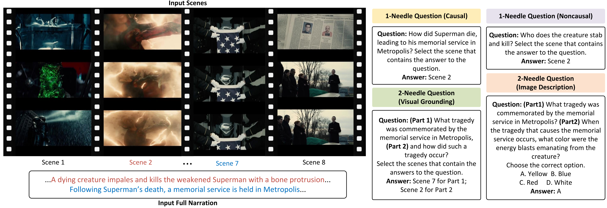

# Causal2Needles

## Overview

**Causal2Needles** is a benchmark dataset and evaluation toolkit designed to assess the capabilities of both proprietary and open-source multimodal large language models in long-video understanding. Our dataset features a large number of "2-needle" questions, where the model must locate and reason over two distinct pieces of information from the video. An illustrative example is shown below:



More background and design details can be found in our Arxiv paper: [Two Causally Related Needles in a Video Haystack](https://arxiv.org/abs/2505.19853)

This repository provides:

* Repository and environment setup instructions
* Instructions for downloading and organizing the dataset
* Example scripts for evaluating both commercial and open-source models

  > Note: All essential files and procedures for evaluation are included in this repo. However, due to model-specific chat templates and dependencies, the fully automated evaluation pipeline currently only supports **Gemini API** and **Qwen2.5-VL**. 
* Automated evaluation of model performance across four types of questions

## Environment Setup

1. Clone the repository and navigate into the folder:

```bash
git clone https://github.com/your-org/Causal2Needles.git
cd Causal2Needles
```

2. Create a Python 3.10 virtual environment using conda (required for Gemini API compatibility):

```bash
conda create -n causal2needles python=3.10 -y
conda activate causal2needles
```

3. Install dependencies:

* **Option 1:** Use `requirements.txt`:

```bash
pip install -r requirements.txt
```

* **Option 2:** Manually ensure PyTorch version >= 2.1.2 is installed (required for Qwen2.5-VL compatibility).

## Dataset Setup

1. Download the **Causal2Needles** dataset from [https://huggingface.co/datasets/causal2needles/Causal2Needles](https://huggingface.co/datasets/causal2needles/Causal2Needles)

   You can do this by running:

   ```bash
   python download_hf.py
   ```

2. After downloading, the folder structure should look like:

```
Causal2Needles/
  ├── datasets/
  │     ├── videos/                # Folder containing video files
  │     ├── annotations.json       # File containing scene annotations
  │     └── questions/             # Folder containing generated questions
  ├── run.sh                       # Main script to start evaluation
  ├── test_VLM_1needle.py          # Script for evaluating Causal 1-Needle questions
  ├── test_VLM_1needle_NC.py       # Script for evaluating Noncausal 1-Needle questions
  ├── test_VLM_2needle_ID.py       # Script for evaluating Image Description 2-Needle questions   
  ├── test_VLM_2needle_VG.py       # Script for evaluating Visual Grounding 2-Needle questions
  └── requirements.txt             # Required dependencies for local model execution
```

## How to Run

We provide example scripts for evaluating two models:

* For **Gemini-series models**, such as Gemini-pro-1.5-002 (requires API key):

```bash
bash run.sh gemini_model_id your_api_key
```

* For **Qwen2.5-VL-7B** (runs locally, no API key required):

```bash
bash run.sh qwen2.5-vl-7b-instruct none
```

The script will automatically run the selected model on all three evaluation tasks.

## Output

After execution, you will obtain the model's accuracy on the following three types of questions:

* **Causal 1-Needle Questions**
* **Noncausal 1-Needle Questions**
* **Visual Grounding 2-Needle Questions**
* **Image Description 2-Needle Questions**

Evaluation results can be found in the corresponding subfolders inside the `Experiments/` directory.

## License

This project is released for academic research purposes only. For commercial usage, please contact the authors.
